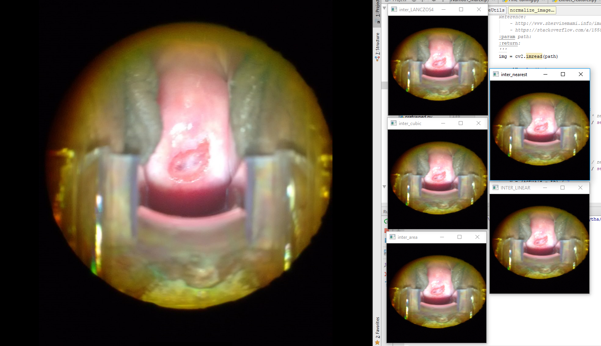
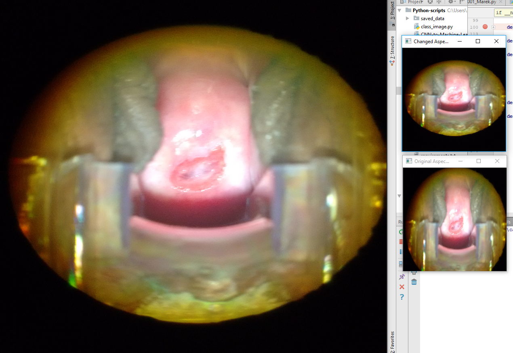
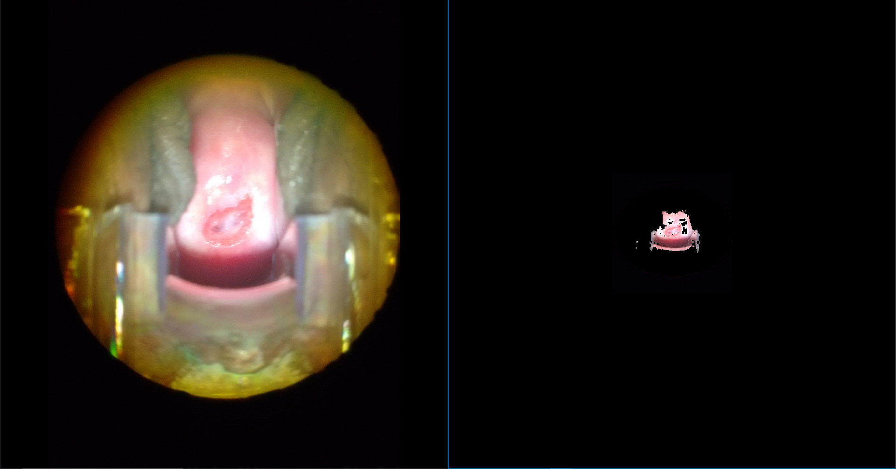
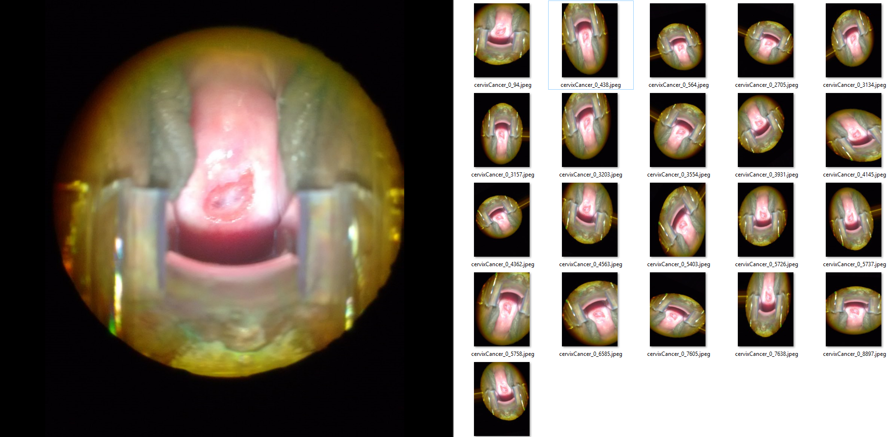
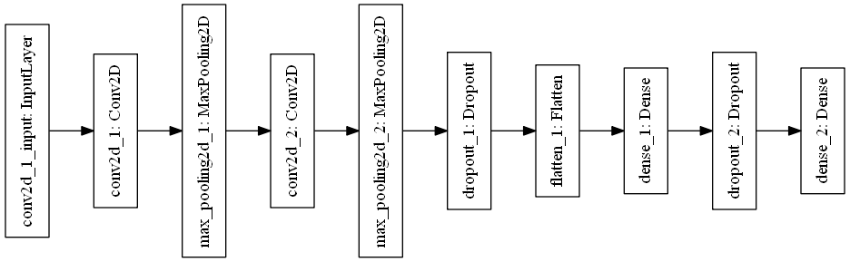
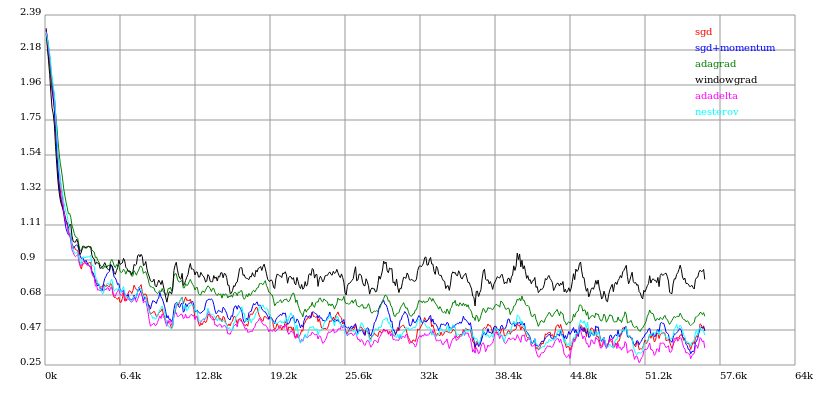

<!--Portada-->

<div class="portada">


# Práctica 2
# Clasificación de Imágenes
*****


<div class="portada-middle">

## Nombre del equipo: **AythaE_MMAguero**
## Ranking: **242** Puntuación: **0.84173**
</br>

### Sistemas Inteligentes para la Gestión en la Empresa
### Máster en Ingeniería Informática
### Curso 2016/17
### Universidad de Granada

</div>

> Nombre: Aythami Estévez Olivas
> Email: <aythae@correo.ugr.es>
> Nombre: Marvin M. Agüero Torales
> Email: <maguero@correo.ugr.es>

</div>

<!-- Salto de página -->
<div style="page-break-before: always;"></div>

## Índice

<!--
Ejemplo de Indice final eliminando el enlace y añadiendo el número de página
- Apartado 1 <span style='float:right'>2</span>
-->

<!-- toc -->

- [1. Exploración de datos](#1-exploracion-de-datos)
  * [1.1. Las mujeres y los niños primero](#11-las-mujeres-y-los-ninos-primero)
  * [1.2. Clase social](#12-clase-social)
  * [1.3. Uniendo ambos criterios](#13-uniendo-ambos-criterios)
  * [1.4. Otras variables](#14-otras-variables)
- [2. Preprocesamiento de datos](#2-preprocesamiento-de-datos)
  * [2.1. Integración y detección de conflictos e inconsistencias en los datos](#21-integracion-y-deteccion-de-conflictos-e-inconsistencias-en-los-datos)
  * [2.2. Transformaciones](#22-transformaciones)
  * [2.3. Reducción de datos](#23-reduccion-de-datos)
- [3. Técnicas de clasificación y discusión de resultados](#3-tecnicas-de-clasificacion-y-discusion-de-resultados)
  * [3.1. Árbol de decisión simple](#31-arbol-de-decision-simple)
  * [3.2. Random Forest](#32-random-forest)
  * [3.3. CForest](#33-cforest)
- [4. Conclusiones y trabajos futuros](#4-conclusiones-y-trabajos-futuros)
- [5. Listado de soluciones](#5-listado-de-soluciones)
- [Bibliografía](#bibliografia)

<!-- tocstop -->

<!-- Salto de página -->
<div style="page-break-before: always;"></div>

## 1. Exploración de datos

Utilizaremos CNNs (Convolutional Neural Networks) y técnicas de clasificación para la predicción del conjunto de imágenes. Antes que nada descargamos las imágenes, hay un conjunto de train y otro de test, también un conjunto extra de train, alrededor de 35 GB en imágenes (2000*3000px aproximadamente, en formato .jpg), por lo que debemos aplicar técnicas para poder reducirlas. A simple vista, se ven imágenes de fondo verde, otras a color, enfocadas de distintos puntos, por lo que, además de reducirlas, se podría tratar de hacerlas más uniformes, en blanco y negro por ejemplo, utilizar data augmentation o aumento de datos, respetar la relación de aspecto, etc.

Para comprobar si el conjunto de datos es balanceado o no-balanceado, necesitamos saber cuantos registros hay de cada variable de clase. Hasta 1.5 se considera clases balanceadas, poseemos tres tipos de clases:
- Tipo 1, con 250
- Tipo 2, con 781
- Tipo 3, con 450

Ahora si tenemos en cuenta el conjunto total de train, incluyendo extras, tenemos para cada uno:
- Tipo 1, con 1441
- Tipo 2, con 4348
- Tipo 3, con 2426

Si consideramos sólo las de train originales, vemos que el conjunto no es balanceado (3.12%), si tomamos además las extras (3.07%), tampoco, aunque se trata de un leve no-balanceo.

En deep learning las redes neuronales necesitan ser entrenadas con un gran número de imágenes para lograr un rendimiento satisfactorio, y sí el conjunto de datos de imagen original es limitada, es mejor hacer el aumento de datos para aumentar el rendimiento. Hay muchas maneras de hacer el aumento de datos, como horizontally flipping, random crops and color jitterin, o intentar combinaciones de múltiples procesamientos diferentes, por ejemplo, realizar la rotación y escalar al azar al mismo tiempo. Además, se puede tratar de aumentar la saturación y el valor (componentes S y V del espacio de color HSV), incluso propuestas como Fancy PCA, introducida por Alex-Net en 2012: "la Fancy PCA podría capturar aproximadamente una propiedad importante de las imágenes naturales, es decir, que la identidad del objeto es invariable a los cambios en la intensidad y el color de la iluminación" (Xiu-Shen, 2015).

En (Schmidt, 2017) se hace un análisis exploratorio sobre el conjunto original de imágenes, vamos a adaptarlo para tomar también el conjunto total de train.

```python
import numpy as np
import pandas as pd
import matplotlib.pyplot as plt
import seaborn as sns
from skimage.io import imread, imshow
import cv2

%matplotlib inline
import plotly.offline as py
py.init_notebook_mode(connected=True)
import plotly.graph_objs as go
import plotly.tools as tls

from subprocess import check_output
print(check_output(["ls", "../input/train"]).decode("utf8"))
```
Type_1 <br/>
Type_2 <br/>
Type_3

```python
from glob import glob
basepath = '../input/train/'

all_cervix_images = []

for path in sorted(glob(basepath + "*")):
    cervix_type = path.split("/")[-1]
    cervix_images = sorted(glob(basepath + cervix_type + "/*"))
    all_cervix_images = all_cervix_images + cervix_images

all_cervix_images = pd.DataFrame({'imagepath': all_cervix_images})
all_cervix_images['filetype'] = all_cervix_images.apply(lambda row: row.imagepath.split(".")[-1], axis=1)
all_cervix_images['type'] = all_cervix_images.apply(lambda row: row.imagepath.split("/")[-2], axis=1)
all_cervix_images.head()
```
<table border="1" class="dataframe">
  <thead>
    <tr style="text-align: right;">
      <th></th>
      <th>imagepath</th>
      <th>filetype</th>
      <th>type</th>
    </tr>
  </thead>
  <tbody>
    <tr>
      <th>0</th>
      <td>../input/train/Type_1/0.jpg</td>
      <td>jpg</td>
      <td>Type_1</td>
    </tr>
    <tr>
      <th>1</th>
      <td>../input/train/Type_1/10.jpg</td>
      <td>jpg</td>
      <td>Type_1</td>
    </tr>
    <tr>
      <th>2</th>
      <td>../input/train/Type_1/1013.jpg</td>
      <td>jpg</td>
      <td>Type_1</td>
    </tr>
    <tr>
      <th>3</th>
      <td>../input/train/Type_1/1014.jpg</td>
      <td>jpg</td>
      <td>Type_1</td>
    </tr>
    <tr>
      <th>4</th>
      <td>../input/train/Type_1/1019.jpg</td>
      <td>jpg</td>
      <td>Type_1</td>
    </tr>
  </tbody>
</table>

Con el anterior bloque, creamos un práctico *dataframe* para hacer algunas agregaciones en los datos.

En este conjunto de imágenes (1481) los archivos están en formato .JPG, el Tipo 2 es el más común, cuenta con un poco más del 50% en los datos de entrenamiento en total, y el Tipo 1 por otro lado, tiene un poco menos del 20%.

```python
print('We have a total of {} images in the whole dataset'.format(all_cervix_images.shape[0]))
type_aggregation = all_cervix_images.groupby(['type', 'filetype']).agg('count')
type_aggregation_p = type_aggregation.apply(lambda row: 1.0*row['imagepath']/all_cervix_images.shape[0], axis=1)

fig, axes = plt.subplots(nrows=2, ncols=1, figsize=(10, 8))

type_aggregation.plot.barh(ax=axes[0])
axes[0].set_xlabel("image count")
type_aggregation_p.plot.barh(ax=axes[1])
axes[1].set_xlabel("training size fraction")
```


Lo mismo sucede sobre el conjunto de entrenamiento adicional (6734).


Como era de esperarse al utilizar el conjunto total (8215), la tendencia es la misma.


Como se ven en lás imágenes, el conjunto de datos no es balanceado, tiene una cantidad considerable de imágenes y de gran tamaño. En el siguiente apartado hablaremos de los métodos de Preprocesamiento aplicados a este conjunto.

## 2. Preprocesamiento de datos

Teniendo en cuenta que nos encontramos ante un problema de reconocimiento de imagenes las técnicas típicas que hemos aprendido de preprocesamiento como eliminación de outlayers, imputación de valores perdidos,... no son aplicables. Por ello hemos empleado algunas técnicas de preprocesamiento de imagenes.

### 2.1. Redimensionado
Como se ha comentado ya las imagenes originales tienen una resolución muy elevada, cosa que las hace inmanegables en la práctica teniendo en cuenta nuestra capacidad computacional (un ordenador sin GPU y otro con una GPU de hace 4 años). Inicialmente partimos de unas imágenes redimensionadas por el profesor Juan Gómez en tamaño 256 \* 256 px cambiando las proporciones originales de las imagenes (que son distintas entre sí a su vez). Con el objetivo de lograr que ocuparan menos procedimos a redimensionar nosotros mismos las imagenes guardandolas en formato `.jpg` en lugar del `.png` en el que se encontraban las imágenes de Juan Gómez, ya que este formato aplica una compresión más fuerte a las imagenes aunque se produzca una pérdida de calidad de las mismas. Para llevar a cabo este redimensionado he utilizado el paquete de R [**EBImage**](https://www.bioconductor.org/packages/release/bioc/html/EBImage.html) como se recomendó en las clases de prácticas. Tras un elevado tiempo de computo se generaron 3 carpetas con las imágenes de train, test y train + adicionales respectivamente. Aun estas imágenes resultaban demasiado grandes para nuestros dispositivos, tras leer las imagenes en arrays de datos guardabamos estos arrays en disco en un único fichero para facilitar la lectura posterior, ocupando un total de 7 GB entre los archivos con las imagenes de test y las de train + adicionales. Por lo tanto estas imagenes saturaban nuestra memoria RAM y nos vimos obligados a redimensionarlas a un tamaño de 64 \* 64 px.

Con estas imagenes ya pudimos empezar a trabajar en modelos básicos, pero decidimos intentar mejorar la redimensión, para redimensionar las imagenes a 64\*64 se utilizo la conocida librería [**OpenCV**](http://opencv.org/) por ello estuvimos consultando la documentación de su método `resize()` donde parece intesante comprobar los métodos de interpolación utilizados para la redimensión, en la siguiente imagen se puede apreciar una imagen del dataset de train a la izquierda y sus redimensiones en 256\*256 utilizando todas las interpolaciones disponibles a la derecha:



Siguiendo las recomendaciones de la documentación para hacer imágenes más pequeñas se recomienda la interpolación CV_INTER_AREA por lo que es la que he aplicado, teniendo en cuenta que siempre voy a redimensionar imágenes para hacerlas pequeñas, no más grandes.

Otra cosa que se nos ocurrió para poder mejorar la calidad de los datos era hacer una redimensión que respete las proporciones originales de las imágenes, ya que estas son diferentes (algunas más anchas que altas y viceversa) para ello llevamos a cabo una redimensión alternativa que respetaba las proporciones a costa de recortar algunos trozos periféricos de las imágenes. Esto podría parecer perjudicial, pero la gran mayoria de las imagenes la región de interes se encuentra centrada, bien en un circulo como se aprecia en la imagen previa o bien con su fondo original, pero en cualquiera de los casos la zona uterina se encuentra en el centro. En la siguiente imagen podemos comparar los resultados viendo la imagen original a la izquierda y los dos tipos de redmiensiones en 256\*256.



A pesar de esto no hemos podido encontrar resultados significativos al uso del dataset redimensionado directamente o respetando las proporciones originales.

Adionalmente hemos creado diversas redimensiones para distintos modelos que no admitian el tamaño 64\*64 y para poder probar con tamaños superiores, pero con un coste computacional demasiado elevado.

### 2.2. Transformaciones
Para facilitar la predicción a los modelos con este dataset hemos visto en múltiples ejemplos y familias de modelos distintos que suele ser recomendable normalizar los datos antes de pasarlos al modelo, es decir cambiar el valor de los pixeles de cada uno de los canales del rango 0-255 al rango 0-1, para ello dividimos todos los valores de los pixeles entre 255 tras redimensionar.

### 2.3. Aumento de datos
Partiendo de [3] hemos intentado generar más imagenes a partir las existentes utilizando un método para extraer el area de interes o ROI en inglés, este método simplemente normaliza las imágenes pasandolas a blanco y negro y hace que aquellos pixeles cuyo valor sea menor 0,7 (no sean demasiado claros) se conserven en la imagen generada y aquellos muy claros se pongan a negro, este método es demasiado aleatorio para generar imagenes nuevas, ya que dependiendo de las características de cada imagen algunas si que funcionan bíen, pero aquellas que tienen más luz pierden demasiada información.

En la siguiente imagen podemos apreciar la imagen original usada previamente para comparar con su homologa tras pasar por el método de extracción del ROI y redimensión a 256\*256


Como se comentará en más detalle en el siguiente apartado nuestra principal herramienta ha sido la librería de Deep Learning Keras, esta libraría contiene muchas utilidades adcionales para problemas de reconocimiento de imágenes, entre ellas métodos para realizar aumento de datos realizando transformaciones básicas como zooms, desplazamientos verticales u horizontales... en concreto hablo de `ImageDataGenerator`. Siguiendo los consejos de [8] creo una instancia de dicha clase con los siguientes parámetros:
```python
datagen = ImageDataGenerator(
           rotation_range=40,
           width_shift_range=0.1,
           height_shift_range=0.1,
           rescale=1. / 255,
           shear_range=0.2,
           zoom_range=0.3,
           horizontal_flip=True,
           vertical_flip=True,
           fill_mode='nearest')
```
Donde se establecen las transformaciones a llevar a cabo, se puede ver que se aplicarán rotaciones aleatorias de hasta 40º, desplazamientos horizontales y verticales de como mucho el 10% de la imagen en ambas direcciones, zooms de hasta el 30%, flips horizontales y verticales así como [transformaciones shear](https://en.wikipedia.org/wiki/Shear_mapping). En la siguiente imagen se aprecia la imagen original a la izquierda y ejemplos de las que se generan con aumento de datos utilizando la mencionada instancia de `ImageDataGenerator`:


## 3. Técnicas de clasificación y discusión de resultados

Discusión de las técnicas y herramientas de clasificación empleadas, justificación de su elección.

Descripción y discusión de las soluciones obtenidas, incidiendo en la interpretación de los resultados. Análisis comparativo en caso de utilizar diferentes técnicas y/o parámetros de configuración en diferentes aproximaciones.

### Herramientas

Hemos utilizado [Keras](https://keras.io/), una librería de Python para Deep Learning, con [Tensorflow](https://www.tensorflow.org/) como backend, una librería de Python para computación numérica, en un equipo con una GPU (Unidad de Procesamiento Gráfico) antigua (pero para suerte nuestra, aún podía ejecutar esta herramienta), y con otro equipo (con un par de años) con CPU (Unidad de Procesamiento Central) solamente. Los tiempo con CPU estaban sobre el doble (o un poco más) que con GPU, lo que delata que no se trata de una GPU de última generación.

Además nos hemos valido de [Scikit-learn](http://scikit-learn.org), una librería de Python para Machine Learning, para realizar predicciones con algoritmos de clasificación sobre las características extraídas de las CNNs.

La decisión de utilizar de estas herramientas es porqué son las más populares en el ámbito de la competencia, en la misma página de Kaggle hay mucha documentación proporcionada por la comunidad: como discusiones, tutoriales, etc. Además hoy por hoy, Tensorflow se ganado el mercado de Deep Learning, que con Keras se logra abstraerla bastante, pudiendo aprovecharla en tan sólo pocas líneas. Intentamos utilizar además las herramientas sugeridas en la asignatura sin éxito, puede consultarse más abajo el Apartado *Otras herramientas* para más detalles.

#### Otras herramientas

Primeramente hemos intentado utilizar las herramientas propuestas en clase, [Intel Deep Learning SDK](https://software.intel.com/en-us/deep-learning-training-tool) y [MXNet](http://mxnet.io/api/r/index.html) con R. La primera presentó muchos problemas a la hora de la instalación, que una vez subsanados, al ser una herramienta en versión beta, no iba muy bien de rendimiento en local sobre Linux: tiempos de cómputo altos dejando inutilizado el ordenador para otras tareas, incluso a veces la herramienta daba fallos posteriores a la instalación y uso que que la dejaba no funcional. Pero creemos que en un futuro sería una herramienta muy completa, puesto que se pueden utilizar varias técnicas a tan sólo un clic. Tambíen pensamos que esta herramienta más orientada a ser desplegada en potentes servidores o clusters a los que accedan los usuarios de la herramienta mediante la interfaz web, que en un portatil de prestaciones normales y unos cuantos años de antigüedad como de los que disponemos actualmente. Sobre MXNET, como veníamos familiarizados con ella (al utilizarla en prácticas), quisimos montarla sobre GPU (dedicando 3 días para su compilación en un SO Windows), pero el resultado no fue bueno, con o sin GPU no se completaban las tareas, ya que R Studio, no podía funcionar del todo bien con MXNet.

Además de las anteriores, intentamos aprovechar el [clúster Colfax](https://colfaxresearch.com/kaggle-2017/) ofrecido por Intel para los participantes en la competición de Kaggle. Este custer cuenta con instancias de 256 cores o 96 GB de RAM, por lo que parece prometedora su potencia. Utilizando Keras y Theano como backend, nos fue imposible instalar algunos módulos de Python, puesto que utilizan su propia arquitectura y hay algunos paquetes, módulos o versiones faltantes, y el camino para hacerlo funcionar era largo y extenso; con TensorFlow como backend, solo corría en un core proablemente debido a que no se encuentra disponible para la arquitectura de Intel, con un tiempo de cómputo de un ordenador stándart mucho menor. Para lo que si nos fue útil, fue para el tratamiento de imágenes, donde si pudimos aprovechar la capacidad de cómputo de este clúster. Además en el preprocesamiento, como se mencionó anteriormente utilizamos EBImage, una librería de R para el tratamiento de imágenes.

Incluso hemos intentando contratar instancias de [Amazon Web Services (AWS)](https://aws.amazon.com/es/ec2/Elastic-GPUs/) con GPU con nuestras cuentas de estudiante pero no era posible utilizar éstas debido a las limitaciones de dichas cuentas.

### Técnicas

#### Learning from scratch
Partiendo del ejemplo disponible en [3] creamos una red neuronal convolutiva con las siguientes capas:

Con este modelo lanzamos una primera ejecución con 320 épocas alcanzando un total de 0.88509 aplicando el aumento de datos básico con tamaño de batch de 32 para la generación de imagenes y algo de zoom y rotación realizado en [3] y utilizando las imagenes adicionales de training normalizadas en tamaño 64\*64 sin respetar las proporciones originales.

Animados con este resultado y su tiempo de ejecución que no estaba nada mal (unos 10 s por epoca) decidimos probar a lanzar el mismo modelo utilizando clustar Colfax mencionado previamente, pero esta vez sin utilizar las imagenes adicionales y manteniendo el resto de parámetros iguales, en este caso lanzamos el modelo durante 600 epocas guardando el mejor modelo producido utilizando como criterio el logloss sobre el conjunto de validación. Este conjunto de validación es un subconjunto del de entrenamiento que no se le ha enseñado al modelo y se utiliza para hacerse una idea de como generaliza el modelo, es decir de lo bueno que será con el conjunto de test. El mejor modelo obtenido fue nuestra segunda subida en Kaggle puntuando un total de 1.30324, muy lejos de nuestro primer modelo, lo cual denota la importancia de tener más datos en este problema, ya que aún con las imagenes adicionales no son suficientes para entrenar modelos de Deep Learning. Esta ejecución tambien nos permitió percatarnos de los problemas con Colfax ya que los tiempos eran desorbitados en comparación con nuestros equipos, debido a que no paralelizaba con TensorFlow (tardó más de 24 h en finalizar la ejecución).

Tras perder una mañana intentando configurar Colfax para ejecutar modelos usando Theano pasamos a intentar mejorar el modelo, para ello redujimos el porcentaje de instancias de training dedicadas a validación del 20 al 10 %, además nos pusimos a buscar distintos algoritmos de optimización para redes neuronales además del adamax que utilizaba por defecto nuestra red, buscando en diversos sitios vimos que adadelta parece minimizar el loss bastante bien como se ve en la siguiente gráfica de loss contra numero de ejemplos vistos por la red neuronal (aunque no se especifique la función de loss concreta)



Cambiando simplemente esos dos parámetros y entrenando durante 500 épocas llegamos conseguir un modelo con una puntuación de 0.841, nuestra mejor subida a Kaggle a pesar de haber probado otros métodos más avanzados.

Con el objetivo de sacarle el máximo partido a este modelo decidimos realizar una optimización de los hiperparámetros de la red neuronal siguiendo los consejos de [4] que basícamente entrena todos los modelos para todas las combinaciones de los siguientes parametros:
- Optimizadores: 'adadelta', 'adamax', 'adam'
- Tamaño de batch: 16, 32, 64
- Numero de épocas: 30

Obteniendo como mejor modelo aquel con parámetros adam y tamaño batch 32 obteniendo un 0,9198 sobre validación, usamos ese modelo como base y lo entrenamos durante más epocas pero los resultados no mejoraban por lo que no llegamos a realizar una subida con dicho modelo.


#### Red pre-entrenada

Hemos usado Inception V3 (GoogleNet) y VGG16 (Visual Geometry Group de la Universidad Oxford) como redes pre-entrenadas, puesto que la primera nace en Google y cuenta con su aval, y la segunda, porque refieren en la comunidad de Kaggle que da buenos resultados con este problema, y por sobre todo, es manejable con nuestras capacidades de cómputo. Inception V3, era prácticamente imposible utilizarlo en nuestros ordenadores, reducimos las imágenes a 150\*150 px, puesto que este modelo exige 139\*139 px como mínimo, al contrario de VGG16, que con 48\*48 px basta, por ello con VGG16 utilizamos conjunto de imágenes de 64\*64 px.

Finalmente sólo hemos hecho ejecuciones con Inception V3, porque VGG16, al ser más ligera de capas y requisitos, creímos conveniente utilizarla para fine-tuning. Con 90 épocas y 12 horas de cómputo (en el ordenador con GPU) los resultados obtenidos no fueron muy buenos utilizando los pesos de Imagenet. El conjunto de imágenes utilizadas en estas ejecuciones eran respetando el *aspect ratio*, con data augmentation y tamaños de 150\*150px, lo cuál hacía que ocupe toda la memoria RAM del equipo (llegando a 12 GB, ocupando 4 GB en memoria de intercambio).

#### Fine-tuning

En [8] explican que para realizar el fine-tuning, en nuestro caso, es favorable primero entrenar el clasificador de nivel superior, y sólo entonces comenzar a ajustar los pesos convolucionales a su lado. Por ello, elegimos ajustar sólo el último bloque convolucional en lugar de toda la red para evitar overfitting, ya que toda la red tendría una gran capacidad entrópica y, por lo tanto, una fuerte tendencia a sobreaprendizaje. Las características aprendidas por los bloques convolucionales de bajo nivel son más generales, menos abstractas que las encontradas más arriba, por lo que es razonable mantener los primeros bloques fijos (características más generales) y ajustar sólo la última (más características especializadas). El fine-tuning debe hacerse con una velocidad de aprendizaje muy lenta, típicamente con el optimizador de SGD en lugar de RMSProp por ejemplo, para asegurarse de que la magnitud de las actualizaciones se mantiene muy pequeña, para no arruinar las funciones previamente aprendidas.


Partiendo del script [5], [6], [7] y [8] utilizado para lanzar ejecuciones con una red pre-entrenada, logramos adaptarlo para fine-tuning. Decidimos realizar las pruebas sobre VGG16 por ser más ligero, debido a nuestras capacidades de cómputo, con pesos de Imagenet e imágenes de 64\*64 px, con data augmentation, respetando el *aspect ratio*. Para fine-tuning, tal como lo hicimos con la red pre-entrenada, poníamos las capas de VGG16 o Inception V3 a no entrenables, y le agregabámos la salida adaptada a nuestro problema; no obstante, a diferencia de una red pre-entrenada, es necesario realizar un entrenamiento con las capas de abajo, para VGG16 tomamos las últimas 15. Lastimosamente, aunque el resultado fue bueno, no fue el esperado, puesto que quedo por debajo de nuestro modelo con *from scratch* por unas décimas, ya que esperabámos sea el modelo que nos catapulte a un mejor resultado en la competición. En total hemos corrido 60 épocas a las capas nuevas, y 90 a fine-tuning, en 13 horas de cómputo con el equipo de GPU.

#### Uso de CNNs con Machine Learning

En [8] y [15] se extraen características de modelos de CNNs, en [8], al igual que en [7], lo hacen para volver a entrenar con otra CNN, pero como nosotros ya habíamos empezado con CNNs, decidimos extraer características para utilizarlas con modelos de *Machine Learning* (ML) como el todoterreno *Random Forest* (RF) y el típico aplicado a imágenes: *SVM* (Support Vector Machine). En [15] se extraen características de una CNN, y la pasan a algoritmos de ML, para ello se valen del módulo *scikit-learn* de Python [9], el cual provee varios algoritmos de ML, es como el *Keras* de Deep Learning.

En base a la literatura [15] [9], preparamos ejecuciones con *features maps* del modelo VGG16, con la red pre-entrenada y con *fine-tuning*, respectivamente con la red completa y tomando la última capa convolucional.

```python
model = VGG16(weights='imagenet', include_top=False, input_shape=(3, imgSize, imgSize))
```

y

```python
model = Model(input=baseModel.input, outputs=baseModel.get_layer("block5_pool").output)
```

Las ejecuciones se hicieron con un conjunto de imágenes (incluyendo las extras) sin y con data augmentation (alrededor de 96000 imágenes), manteniendo el ratio en un tamaño de 64\*64 px, para los algoritmos RF y SVM de ML. Con el primero no se lograron resultados demasiado buenos, antes de lanzarlo, probamos con 100, 1000 y 2000 arboles con el conjunto sin data augmentation, resultando mejor ésta, que con data augmentation y 2000 arboles, creemos que esto se debe al overfitting al haber tantas imágenes.

```python
rfClf = RandomForestClassifier(n_estimators=2000, oob_score=True, n_jobs=-1, random_state=RDM, verbose=20,
                                   criterion='gini')
```

Cabe destacar, que estas ejecuciones fueron ya fuera de fecha a la primera etapa de Kaggle, por lo que para cotejar el *logloss*, utilizamos un script provisto por una pareja de compañeros [17] (antes tomamos un envío previo a Kaggle, asegurándonos que de él mismo logloss que de Kaggle), logrando nuestro mejor resultado con 0.833 con SVM sin data augmentation, con los misma entrada que RF. Cabe agregar, que estos modelos los corrimos sobre *Colfax* para aprovechar los 256 cores (que si son aprovechados por *scikit-learn*), de igual manera llevaban unos tiempos de ejecución considerables, especialmente con el conjunto con data augmentation, con RF, pudimos ejecutarlo (7 horas como máximo), pero ya con SVM, los tiempos se dispararon (24 hs), por lo que el servidor de Clúster nos cortaba la ejecución.

```python
svcClf = SVC(kernel="rbf", verbose=True, decision_function_shape='ovo', probability=True, cache_size=5500)
```

#### OVA
Adicionalmente a los modelos mencionados previamente decidimos probar alguna de las técnicas de división de un problema de clasificación multiclase en un problema binario. Una de estas técnicas es One-vs-One (OVO) que se basa en generar 1 clasificador por cada pareja de clases, en el caso de nuestro problema se generarían tres clasificadores, uno para distinguir entre el tipo 1 y el 2, otro para el 1 y el 3 y otro para el 2 y el 3. Posteriormente se combinarían las predicciones de cada uno de los clasificadores individuales.

Otra técnica es One-vs-All (OVA) que crea un clasificador individual por cada clase independiente del problema, cada uno de estos clasificadores se entrena para distinguir entre su clase y todas las demás (sin distinguir entre ellas) combinando posteriormente los resultados de todos los clasificadores.

Nos hemos decantado por probar esta última alternativa, ya que nos parecia más simple de llevar a cabo por no tener muy claro como combinar los resultados en el caso de OVO. Por ello partiendo del modelo básico de learning from scratch (ya que sus tiempos eran aceptables) se dividío el dataset en 3 cambiando las etiquetas para que fueran tipo n y el resto otros pasando estos 3 datasets a 3 copias del mismo modelo y entrenándolos con las imágenes en 64\*64 con tamaño de batch 32 y 20% de datos para validación. Para combinar los resultados simplemente extraemos de cada clasificador el valor de la predicción de la clase para la que está entrenado, obviamente estos resultados no suman 1, pero según se menciona en las normas de kaggle esto no es necesario. El modelo obtuvo un total de 0.9905 en Kaggle, un porcentaje no muy bueno, probablemente debido a la naturaleza desbalanceada del dataset, en especial si se tiene en cuenta que para pasar el dataset a estos modelos unimos dos clases por lo que queda claramente desbalanceado y aunque los modelos individuales de cada clase no obtienen malos resultados, esto se debe a que mayormente predicen la clase "Otros", no la clase para la que han sido creados. Este modelo se podria mejorar utilizando las técnicas que hemos visto en clase para tratar problemas no balanceados como puede ser un _undersampling_ u _oversampling_.

### Comparativa de soluciones

## 4. Conclusiones y trabajos futuros

Breve resumen de las técnicas aplicadas y de los resultados obtenidos.

### Trabajo futuro
... ideas para continuar mejorando las soluciones desarrolladas.

Se podría aplicar técnicas como *features extraction* sobre las imágenes, aunque eso requiere conocer a fondo herramientas como [OpenCV](http://opencv.org/) o [SciLab](http://www.scilab.org/), que se alejan del objetivo de la asignatura y requieren su esfuerzo de aprendizaje. En [11] mencionan que es útil para detectar y aislar diversas porciones o características de una imagen, particularmente importante en el área del *reconocimiento óptico de caracteres*. Existen técnicas de bajo nivel como la detección de bordes, o esquinas, entre otros, teniendo en cuenta la curvatura y el movimiento de la imagen; de forma basada, como umbrales, extracción de blob, o "Hough transform"; y otros de métodos flexibles, como formas parametrizables/deformables o contornos activos.

Utilizar ensambles sobre CNN o ML

Aplicar OVO además de OVA, de una manera manual, puesto que existen módulos como scikit-learn de Python, con modelos como SVM que permite aplicar OVO sobre un conjunto de datos.

### Conclusiones

Capacidad de cómputo
Necesidad de clústeres
Necesidad de GPUs de última generación
Trabajar en CPU es un martirio
EL resultado es directamente proporcional a la capacidad de cómputo
Desigualdad de condiciones
Tiempos de ejecución

<!-- Salto de página -->
<div style="page-break-before: always;"></div>

## 5. Listado de soluciones

Las siguientes abreviaturas representan el Preprocesamiento o el Algoritmo/Software utilizado en las soluciones (y utilizadas en el tabla de abajo):
- ...: ...
-

La siguiente tabla recoge las distintas soluciones presentadas en Kaggle.

| Nº Solución | Preprocesamiento | Algoritmo/Software | % de acierto entrenamiento | % de acierto test (Kaggle) | Posición Ranking           |
|-------------|-------------------|--------------------|----------------------------|----------------------------|----------------------------|
| 1           |                   |                    | 0.8554                     | 0.88509                    | 292                        |
| 2           |                   |                    | 0.7675                     | 1.30324                    | 300                        |
| 3           |                   |                    | **0.**                     | **0.841**                  | **stg 1: 242 / stg 2: 75** |
| 4           |                   |                    | 0.                         | 0.845                      | 261                        |
| 5           |                   |                    | 0.                         | 0.98                       | 261


Posición al cierre de la primera etapa: 160

<!-- Salto de página -->
<div style="page-break-before: always;"></div>

## Bibliografía

<p id="1">

[1]: Kaggle (n.d). Intel & MobileODT Cervical Cancer Screening. Recuperado en Junio de 2017, a partir de <https://www.kaggle.com/c/intel-mobileodt-cervical-cancer-screening>

</p>

<p id="2">

[2]: Xiu-Shen, W. (Octubre, 2015). Must Know Tips/Tricks in Deep Neural Networks (by <a href="http://lamda.nju.edu.cn/weixs/">Xiu-Shen Wei</a>). Recuperado en Junio de 2017, a partir de http://lamda.nju.edu.cn/weixs/project/CNNTricks/CNNTricks.html

</p>

<p id="3">

[3]: Marek 3000 (n.d). Test num 001. Recuperado en Junio de 2017, a partir de <https://www.kaggle.com/marek3000/test-num-001>

</p>

<p id="4">

[4]: J. Brownlee (9 de Agosto 2016). How to Grid Search Hyperparameters for Deep Learning Models in Python With Keras. Recuperado en Junio de 2017, a partir de <http://machinelearningmastery.com/grid-search-hyperparameters-deep-learning-models-python-keras/>

</p>

<p id="5">

[5]: Keras (n.d). ImageNet: VGGNet, ResNet, Inception, and Xception with Keras. Recuperado en Junio de 2017, a partir de <https://keras.io/>

</p>

<p id="6">

[6]: A. Rosebrock (20 de Marzo 2017). ImageNet: VGGNet, ResNet, Inception, and Xception with Keras. Recuperado en Junio de 2017, a partir de <http://www.pyimagesearch.com/2017/03/20/imagenet-vggnet-resnet-inception-xception-keras/>

</p>

<p id="7">

[7]: D. Gupta (1 de junio 2017). Transfer learning & The art of using Pre-trained Models in Deep Learning. Recuperado en Junio de 2017, a partir de <https://www.analyticsvidhya.com/blog/2017/06/transfer-learning-the-art-of-fine-tuning-a-pre-trained-model/>

</p>

<p id="8">

[8]: F. Chollet (5 de junio 2016). Building powerful image classification models using very little data. Recuperado en Junio de 2017, a partir de <https://blog.keras.io/building-powerful-image-classification-models-using-very-little-data.html>

</p>

<p id="9">

[9]: scikit-learn (n.d). Scikit-learn, Machine Learning in Python. Recuperado en Junio de 2017, a partir de <http://scikit-learn.org/stable/index.html>

</p>

<p id="10">

[10]: P. Schmidt (n.d). Cervix EDA & Model selection. Recuperado en Junio de 2017, a partir de <https://www.kaggle.com/philschmidt/cervix-eda-model-selection>

</p>

<p id="11">

[11]: Wikipedia (12 de mayo 2017). Feature extraction. Recuperado a partir de <https://en.wikipedia.org/w/index.php?title=Feature_extraction&oldid=779974336>

</p>

<p id="12">

[12]: A. Oleś et al (24 de abril 2017). Introduction to EBImage. Recuperado en Junio de 2017, a partir de <https://bioconductor.org/packages/release/bioc/vignettes/EBImage/inst/doc/EBImage-introduction.html>

</p>

<p id="13">

[13]: Karpathy, A. (n.d.). ConvNetJS Trainer Comparison on MNIST. Recuperado en Junio de 2017, a partir de <http://cs.stanford.edu/people/karpathy/convnetjs/demo/trainers.html>

</p>

<p id="14">

[14]: Ruder, S. (19 de enero 2016). An overview of gradient descent optimization algorithms. Recuperado en Junio de 2017, a partir de <http://sebastianruder.com/optimizing-gradient-descent/>

</p>

<p id="15">

[15]: Takuya. (n.d.). Using pre-trained network. Recuperado 21 de junio de 2017, a partir de <https://www.kaggle.com/katotakuya/using-pre-trained-network>

</p>

<p id="16">

[16]: OpenCV (n.d.). Documentation. Recuperado en Junio de 2017, a partir de <http://docs.opencv.org/2.4.13.2/>

</p>

<p id="17">

[17]: G. Rivas, A. Casado (2017). Intel-CervicalCancer-KaggleCompetition. Recuperado en Junio de 2017, a partir de <https://github.com/Griger/Intel-CervicalCancer-KaggleCompetition>

</p>


## Anexos

Se adjuntan los scripts utilizados de Python, también disponibles en [GitHub](https://github.com/mmaguero/Intel-mobileodt-cervical-cancer-screening).
